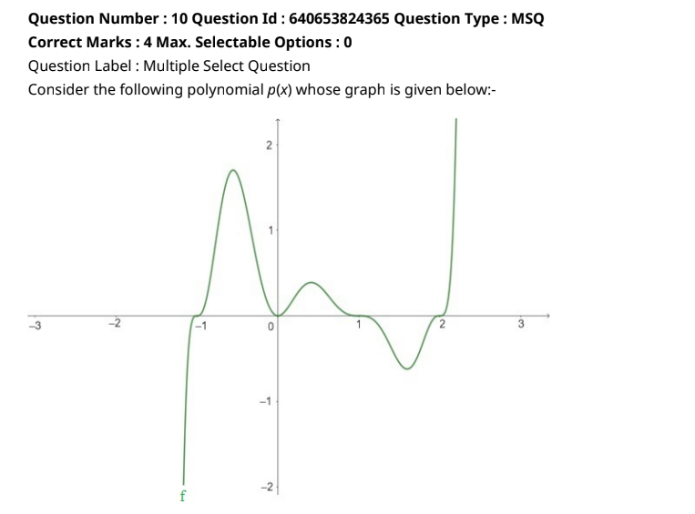
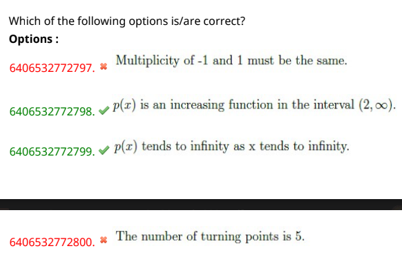

- What is  multiplicity of  graph?
    - multiplicity of a graph is the number of times a particular value appears in the graph.
    - If the graph crosses the x-axis and appears almost linear at the intercept, it is a single zero. If the graph touches the x-axis and bounces off of the axis, it is a zero with even multiplicity. If the graph crosses the x-axis at a zero, it is a zero with odd multiplicity.  

    - zeros of the function are the x-intercepts of the graph of the function.

    - even multiplicity: the graph touches the x-axis and bounces off of the axis.
    - odd multiplicity: the graph crosses the x-axis at a zero.
    - single zero: the graph crosses the x-axis and appears almost linear at the intercept.
    - if the graph at the intercept is almost flat, then it should be multiplicity 2, given that the graph touches the x-axis and bounces off of the axis.

-  Solution:
    - option 1 : 
        - since -1 is crossing the x-axis, it is a zero(x-intercept) with odd multiplicity.
        - and 1 is also crossing the x-axis, but the graph is almost flat at the intercept, so it is a zero(x-intercept) , so it is not same as the -1

    - option 2 :
        - at interval (2,inf) , the value of  y keeps increasing
    - option 3 :
        - p(x) tends to inf as x tends to inf , is true
    - option 4 :
        - turning point is when the graph changes direction,from increasing to decreasing or vice versa.
        - the number of turning points are 
            - -0.5,0,0.5,1.5
            - therefore the number of turning points are 4