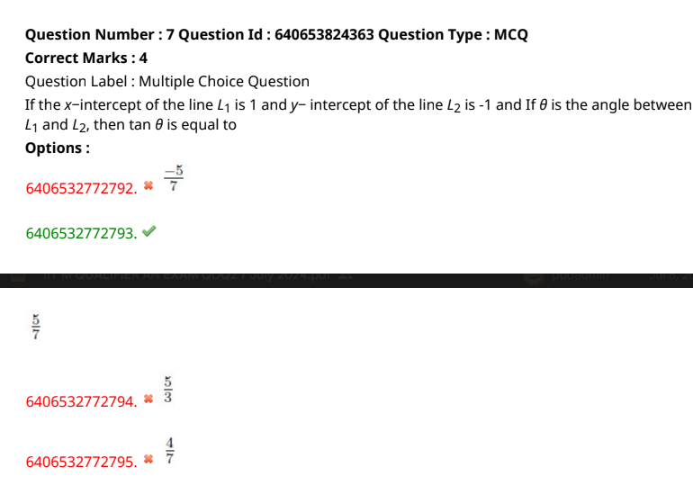

- solution link : https://chatgpt.com/share/45908d87-37c8-45c4-aafb-c502858da0cc

- P1 = (3,-2)
- P2 = (-1,5)
- L1 passes through P1(3,-2) and L2 passes through P2(-1,5)
- If the x- intercept of the line L1 is 1
- angle between L1 and L2 is pi/2 or 90 degrees

doubt
