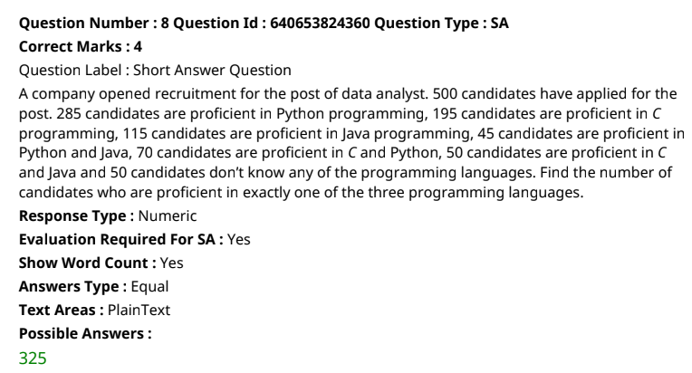

Total applied: 500 candidates
- Python= 285
- c = 195
- Java = 115
- Python & Java = 45
- Python & c = 70
- C & Java = 50
- unskilled = 50
 ## Fint the no of candidates proficient in exactly one of the 3 languages.

- solution:  https://chatgpt.com/share/4efa1c74-f9c3-468c-9b5f-4f203d9b4476

doubt
