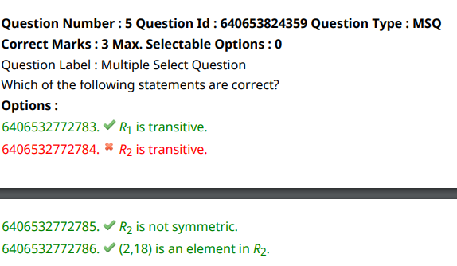
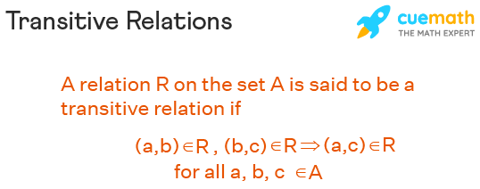

A = {0,2,4,6,8,10,12,14,16,18,20}

B = {6,12,18}

R1={(2,6),(6,6),(2,12),(4,12),(6,12),(12,12),(2,18),(6,18),(18,18)}

R2={(4,6),(14,6),(8,12),(18,12),(2,18),(12,18)}

 

Option 1 :
- (2,6)-> (6,12)->(2,12)
since all the three are in R1, R1 is transitive.

Option 2:
- We cannot form a transitive relation here. Hence, R2 is not transitive.

Option 3:

- 
R2={(4,6),(14,6),(8,12),(18,12),(2,18),(12,18)}
- Symmetric relationship is shown here.
If (2,4) is in R1, then (4,2) is also in R1.
- this should be for all the elements in R1.

-Hence, R2 is not symmetric.

Option 4:
- (2,18) is present in R2.
