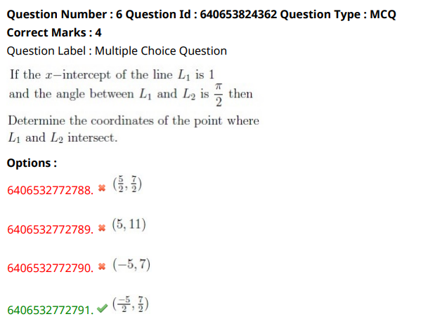

- P1 = (3,-2)
- P2 = (-1,5)
- L1 passes through P1(3,-2) and L2 passes through P2(-1,5)
- If the x- intercept of the line L1 is 1
- angle between L1 and L2 is pi/2 or 90 degrees
## Determine the coordinates of points where L1 and L2 intersect.
- To find intersection of L1 and L2, we need to determine the equation of L1 and L2.

- Equation of line y = mx + c
    - y means y coordinate 
    - x means x coordinate
    - m means slope 
    - c means y-intercept
    
 - L1 passes through (1,0) and (3,-2)
    - Equation of L1 is calculated using two points 
    - y-y1/x-x1 = y2-y1/x2-x1
    - y1=0, x1=1
    - y2=-2, x2=3
    - y-0/x-1=-2-0/3-1
    - y = -2(x-1)/2
    - y= -(x-1)
    - L1 equation = `y= -x+1` 
- L2 is perpendicular to L1
    - Perpendicular lines have opposite (signs) reciprocal (flip fraction). So if slope is -4/5, the perpendicular slope is 5/4. If y=mx+b, we can subtract mx on both sides to get b=y-mx, and subbing in x=4, y=-3, and m=5/4, we get b=-3-(5/4)(4), 4s cancel, so you have b=-3-5=-8. Thus equation is y=5/4 x -8.
    - Equation of L2 is given by 
        - slope of L1,m1 = -1
        - Slope of L2,m2 = -1/m1 = -1/-1 = 1
    - L2 equation  = y = m2x + 1 => `y = 1x + 1`

- Intersection of L1 and L2
    - y = 1x + 1
    - y = -x+1

doubt
